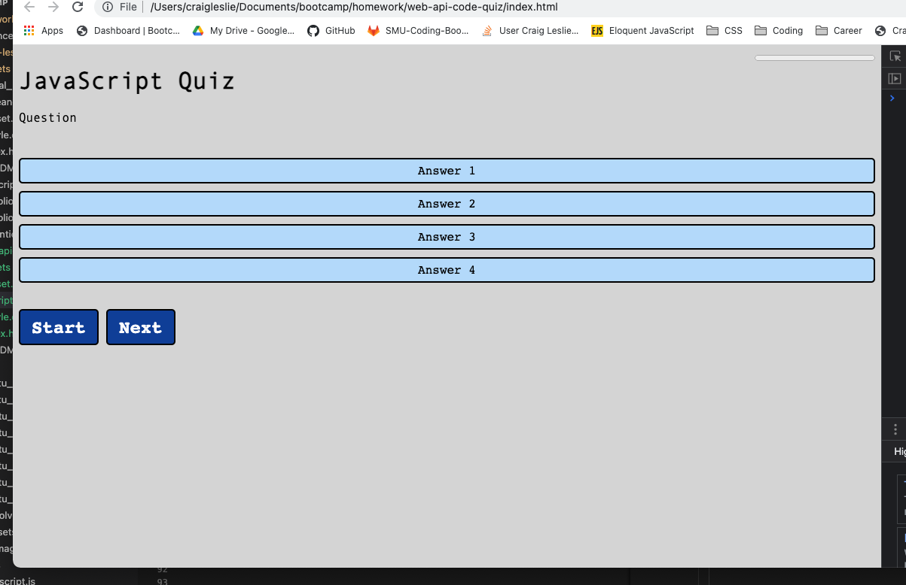

# web-api-code-quiz

Created a quiz with JavaScript. Start button initializes the quiz and timer. User has the option to skip a question with the Next button.
Each time the user clicks on an answer, they are directed to the next question. Once the quiz is completed, the user is presented with his or her score and asked to enter their initials. This information is added to the local storage.

## Screenshot of webpage

## Link to final page

[Here is a link to my final page](https://3roses.github.io/craig-leslie-portfolio/)

